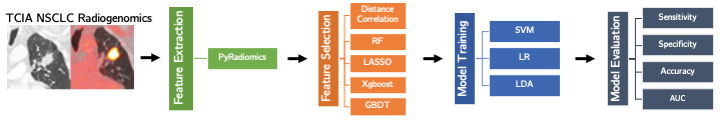
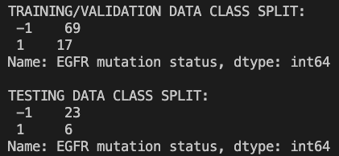
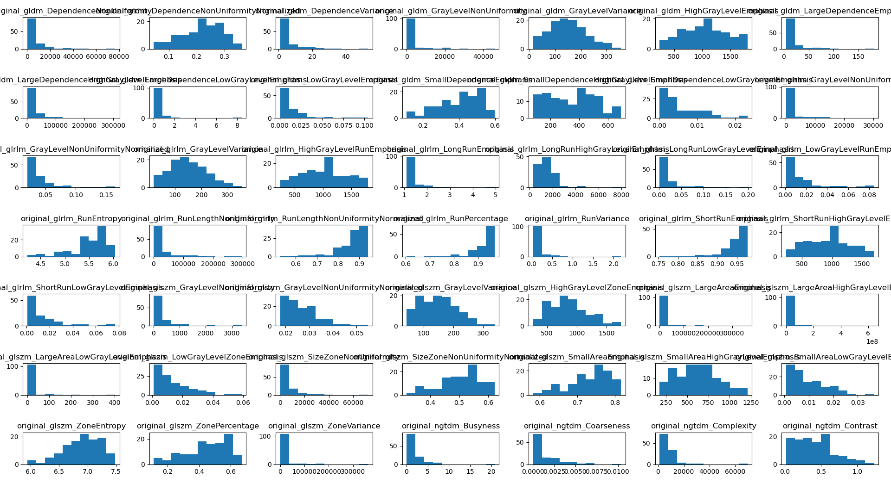
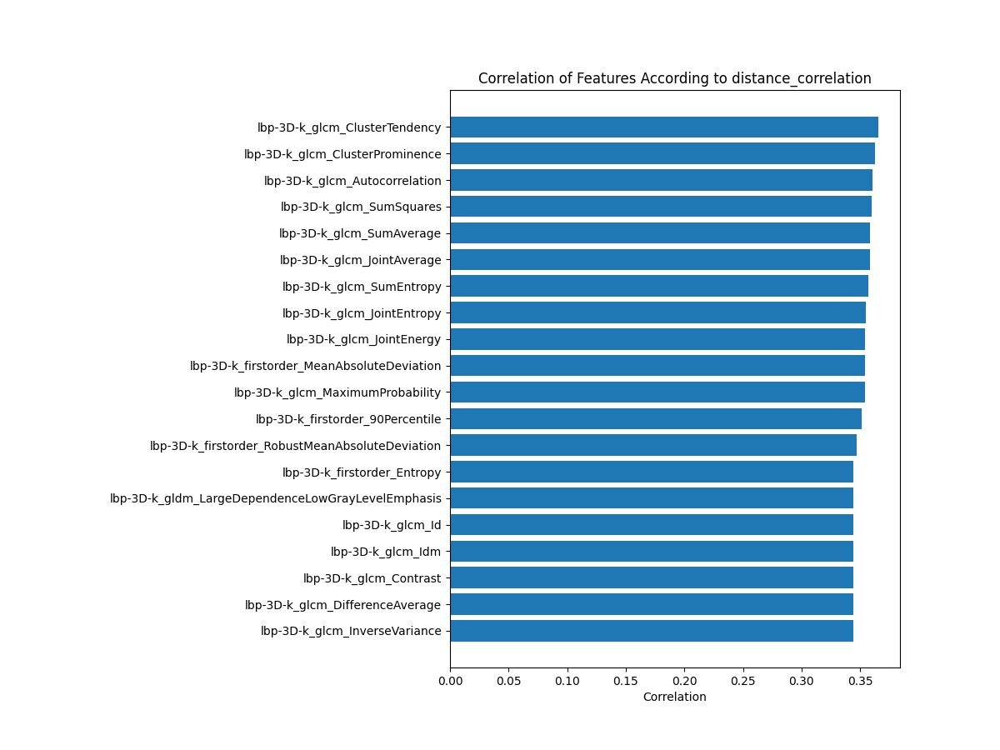
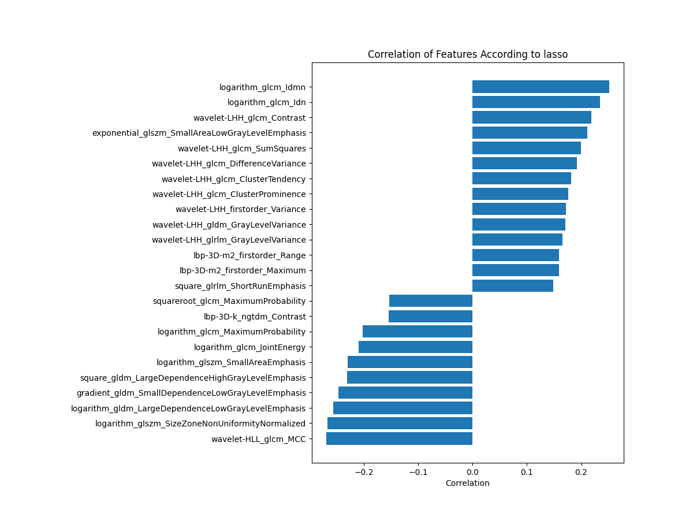
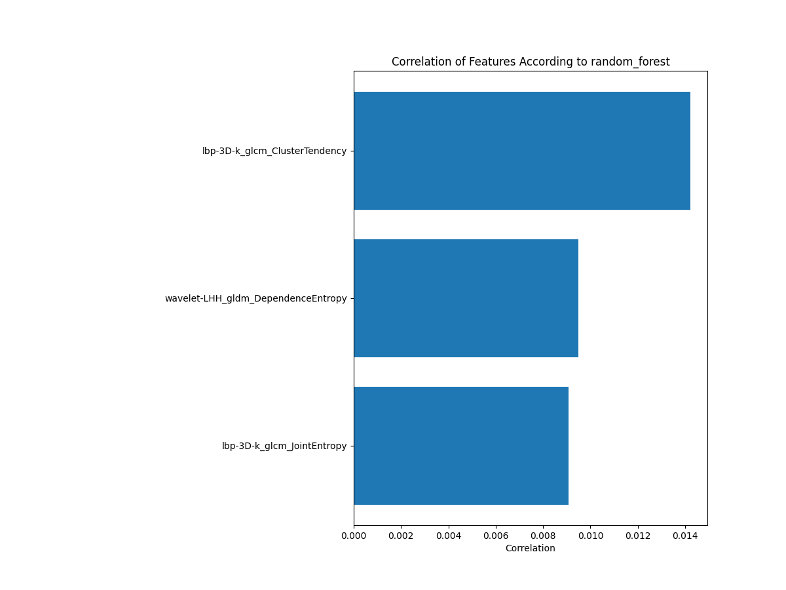
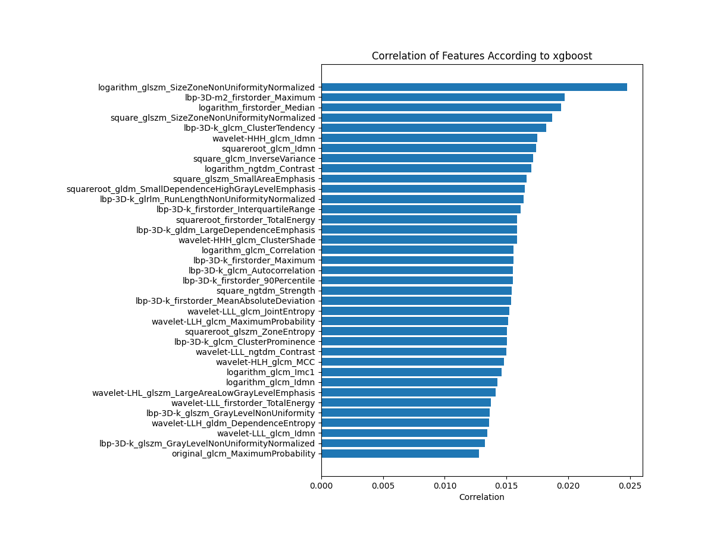

# ece475

**Lawrence Chillrud** <chili@u.northwestern.edu> \
**Christian Duffee** <christian.duffee@northwestern.edu> \
**Charilaos Apostolidis** <j4k1n4@u.northwestern.edu>

Directory for EE475 final project.

**Radiogenomic machine learning (ML) for EGFR mutation status prediction from Computed Tomography (CT) scans of patients with Non-Small Cell Lung Cancer (NSCLC).**

LINK TO THIS REPOSITORY (please view online): https://github.com/lawrence-chillrud/ece475 

Table of contents:
1. [Overview](#1-Overview)
2. [Requirements](#2-requirements)
3. [The data](#3-the-data)
4. [Downloading the data](#4-downloading-the-data)
5. [Converting the data](#5-converting-the-data)
6. [Feature extraction](#6-feature-extraction)
7. [Data exploration](#7-data-exploration)
8. [Feature selection](#8-feature-selection)
9. [Classification results](#9-classification-results)
9. [References](#references)

## 1. Overview

We are using a radiogenomic machine learning pipeline to predict EGFR mutation status from Computed Tomography (CT) scans of patients with Non-Small Cell Lung Cancer (NSCLC). 

EGFR mutation status, a binary characteristic in NSCLC {`Mutant`, `Wilde Type`}, is an important biomarker for NSCLC patients that correlates highly with prognosis (the EGFR mutated variant confers better prognosis). As such, it is crucial to know the EGFR mutation status of a tumor in order to determine the best treatment options available to the patient.

In our project, we take the following approach to the EGFR mutation status prediction task:



This pipeline then yields 15 models total (each of the 5 feature selectors crossed with each of the 3 classification models).

## 2. Requirements

We provide the `environment.yml` YAML file for easy cloning of the exact conda virtual environment used to run all project scripts. With [conda](https://conda.io/projects/conda/en/latest/user-guide/install/download.html) installed, simply run the following line in `ece475` directory:

```conda env create --file environment.yml```

Then activate the newly created `rgml` environment with:

```conda activate rgml```

You should now be able to run all scripts in the `code` folder without issue.

## 3. The data

The dataset we are using is The Cancer Imaging Archive's (TCIA)[^1] publicly available [NSCLC Radiogenomics dataset](https://wiki.cancerimagingarchive.net/display/Public/NSCLC+Radiogenomics), made from a cohort of 211 NSCLC patients. A brief description from the dataset's TCIA page is reproduced below:

> "The dataset comprises Computed Tomography (CT) images, ... and segmentation maps of tumors in the CT scans. Imaging data are also paired with results of gene mutation analyses... from samples of surgically excised tumor tissue, and clinical data, including survival outcomes. This dataset was created to facilitate the discovery of the underlying relationship between tumor molecular and medical image features, as well as the development and evaluation of prognostic medical image biomarkers."

We refer interested readers to Bakr et al.[^2] for further details regarding the dataset.

## 4. Downloading the data
1. Download [the .tcia manifest file](https://wiki.cancerimagingarchive.net/download/attachments/28672347/NSCLC_Radiogenomics-6-1-21%20Version%204.tcia?version=1&modificationDate=1622561925765&api=v2) (88 KB) that will be needed to later retrieve the images and their segmentations from the NCBI Data Retriever (see steps 3 and 4). We include this `.tcia` file here in the [data/TCIA/](data/TCIA/) folder incase the download link changes in the future.
2. Download [the .csv file](https://wiki.cancerimagingarchive.net/download/attachments/28672347/NSCLCR01Radiogenomic_DATA_LABELS_2018-05-22_1500-shifted.csv?version=1&modificationDate=1531967714295&api=v2) (67 KB) providing the clinical data obtained for each patient (including each patient's EGFR mutation status). Again, we include this `.csv` here in the [data/TCIA/manifest/](data/TCIA/manifest/) folder (with the infix `DATA_LABELS`) should the download link change in the future. (Note: this clinical data `.csv` file is different from the `metadata.csv` file we also include in the same folder. The `metadata.csv` file can be obtained from scratch by following step 4 below.)
3. Follow [these instructions](https://wiki.cancerimagingarchive.net/display/NBIA/Downloading+TCIA+Images#DownloadingTCIAImages-InstallingtheNBIADataRetriever) to install the NCBI Data Retriever application.
4. Now open the `.tcia` manifest file downloaded in step 1 (this will open the NCBI app installed in step 3). Follow the app's prompts to download all the images and their segmentations (97.6 GB total). They will be downloaded in `.dcm` DICOM format. Detailed instructions can be found [here](https://wiki.cancerimagingarchive.net/display/NBIA/Downloading+TCIA+Images#DownloadingTCIAImages-OpeningtheManifestFileandDownloadingtheData).

_Note: Because we provide all the `.csv` files needed throughout the main ML analysis in the [data/generated/](data/generated/) directory, the interested reader need only follow the above steps to download the raw DICOM files if they want to perform the conversion (section 5 below) and feature extraction (section 6 below) themselves. Otherwise, sections 4-6 in this README need not be followed computationally, and just serve as documentation for how the analysis data was prepared. The relevant files for the main analysis are [NSCLC_labels.csv](data/generated/NSCLC_labels.csv) (output by section 5) and [NSCLC_features.csv](data/generated/NSCLC_features.csv) (output by section 6)._

## 5. Converting the data
In order to make the data smaller and easier to work with, we must convert all downloaded CT scans and their accompanying segmentations from their raw DICOM `.dcm` format to a compressed NIfTI `.nii.gz` format. Interested readers can study [this useful DICOM and NIfTI Primer post](https://github.com/DataCurationNetwork/data-primers/blob/master/Neuroimaging%20DICOM%20and%20NIfTI%20Data%20Curation%20Primer/neuroimaging-dicom-and-nifti-data-curation-primer.md) for the differences between the two file types.

There are many tools for converting `.dcm` -> `.nii.gz`; the software we choose to employ is `dcm2niix`[^3]. Documentation for `dcm2niix` can be found [here](https://www.nitrc.org/plugins/mwiki/index.php/dcm2nii:MainPage).

<!---
1. Install `dcm2niix` by following [these installation instructions](https://github.com/rordenlab/dcm2niix#Install). _Note: for faster compression, also download the soft (ie optional) dependency [pigz](https://github.com/madler/pigz). This can be done in a conda environment with:_ 

    ```conda install -c conda-forge pigz```

2. 
-->

We convert all CT scans and segmentations to `.nii.gz` files by running the [1_convert_dcms.py](code/1_convert_dcms.py) script, which utilizes `dcm2niix` under the hood. This script also outputs the [NSCLC_labels.csv](data/generated/NSCLC_labels.csv) file.

## 6. Feature extraction

Now that we have downloaded the data and converted it into the appropriate format, we can extract features from the CT scans and their segmentations using the `pyradiomics` python package[^4]. Documentation for `pyradiomics` is extensive and can be found [here](https://pyradiomics.readthedocs.io/en/latest/index.html#).

<!---
1. Install `pyradiomics` with the following _(Note that installation via conda had unresolved bugs at the time of writing)_:

    ```pip install pyradiomics```
-->

We extract radiomic features from the `.nii.gz` files by running the [2_extract_features.py](code/2_extract_features.py) script. This script outputs the [NSCLC_features.csv](data/generated/NSCLC_features.csv), which (together with [NSCLC_labels.csv](data/generated/NSCLC_labels.csv)) can be used for downstream ML tasks.

## 7. Data exploration

We split the dataset into training and testing data as follows:


### Training/Validation Data Class Split 
| \-1 | 69 |
| --- | -- |
| 1   | 17 |

### Testing Data Class Split 
| \-1 | 23 |
| --- | -- |
| 1   | 6 |

See the [code/3\_visualize\_features.py](code/3_visualize_features.py) file for code used to generate these plots. Visuallzing some of the features we get



Not all of them are normally distributed, so we decide to normalize them rather than standardize (see the `prep_data()` function in [code/utils.py](code/utils.py)).

## 8. Feature selection

Five feature selection algorithms were used to find the most descriptive features using a grid search over possible hyperparameters. These algorithms are distance correlation, lasso, random forest, xgboost, and gradient boosted decision trees. Only the first four were run due to time constraints with re: exhaustive gridsearches. Furthermore, due to the nature of the algorithms, xgboost, random forest, and lasso allowed an additional search to determine how many of the top features should be included in the model.





## 9. Classification results

Final classification results on all 15 models (validation and test):

|                     |                      |       |       | Validation |           |        |  |       |       | Test   |           |        |
|---------------------|----------------------|-------|-------|------------|-----------|--------|--|-------|-------|--------|-----------|--------|
| Classifier          | Feature Selector     | AUC   | F1    | MCC        | Precision | Recall |  | AUC   | F1    | MCC    | Precision | Recall |
| Logistic Regression | Distance Correlation | 0.680 | 0.455 | 0.312      | 0.384     | 0.592  |  | 0.601 | 0.364 | 0.218  | 0.400     | 0.333  |
|                     | Lasso                | 0.780 | 0.570 | 0.472      | 0.459     | 0.792  |  | 0.453 | 0.154 | -0.089 | 0.143     | 0.167  |
|                     | Xgboost              | 0.694 | 0.470 | 0.324      | 0.367     | 0.688  |  | 0.663 | 0.462 | 0.309  | 0.429     | 0.500  |
|                     | Random Forest        | 0.738 | 0.531 | 0.407      | 0.433     | 0.708  |  | 0.558 | 0.308 | 0.110  | 0.286     | 0.333  |
| SVM                 | Distance Correlation | 0.543 | 0.262 | 0.099      | 0.300     | 0.258  |  | 0.598 | 0.375 | 0.167  | 0.300     | 0.500  |
|                     | Lasso                | 0.694 | 0.485 | 0.382      | 0.498     | 0.513  |  | 0.435 | 0.000 | -0.173 | 0.000     | 0.000  |
|                     | **Xgboost**              | 0.574 | 0.309 | 0.130      | 0.279     | 0.379  |  | **0.703** | **0.500** | **0.346**  | 0.400     | 0.667  |
|                     | Random Forest        | 0.644 | 0.433 | 0.326      | 0.526     | 0.404  |  | 0.540 | 0.222 | 0.106  | 0.333     | 0.167  |
| LDA                 | Distance Correlation | 0.546 | 0.256 | 0.084      | 0.257     | 0.283  |  | 0.598 | 0.375 | 0.167  | 0.300     | 0.500  |
|                     | Lasso                | 0.630 | 0.374 | 0.239      | 0.364     | 0.438  |  | 0.457 | 0.000 | -0.139 | 0.000     | 0.000  |
|                     | Xgboost              | 0.487 | 0.191 | -0.033     | 0.156     | 0.258  |  | 0.601 | 0.364 | 0.218  | 0.400     | 0.333  |
|                     | Random Forest        | 0.514 | 0.140 | 0.046      | 0.250     | 0.100  |  | 0.500 | 0.000 | 0.000  | 0.000     | 0.000  |

This table shows various metrics describing the accuracites achieved for each classifier and feature selection algorithm pairs. The best validation result was achieved by usign a logistic regression with a lasso feature selector. The best testing result was achieved by using
 an SVM with an XGBoost feature selector.

## References

[^1]: Clark K, Vendt B, Smith K, Freymann J, Kirby J, Koppel P, Moore S, Phillips S, Maffitt D, Pringle M, Tarbox L, Prior F. [The Cancer Imaging Archive (TCIA): Maintaining and Operating a Public Information Repository](https://doi.org/10.1007/s10278-013-9622-7). _Journal of Digital Imaging_, Volume 26, Number 6, December, 2013, pp 1045-1057.  

[^2]: Bakr S, Gevaert O, Echegaray S, Ayers K, Zhou M, Shafiq M, Zheng H, Benson JA, Zhang W, Leung ANC, Kadoch M, Hoang CD, Shrager J, Quon A, Rubin DL, Plevritis SK, Napel S. [A radiogenomic dataset of non-small cell lung cancer.](https://pubmed.ncbi.nlm.nih.gov/30325352/) _Sci Data_. 2018 Oct 16;5:180202.

[^3]: Li X, Morgan PS, Ashburner J, Smith J, Rorden C. [The first step for neuroimaging data analysis: DICOM to NIfTI conversion.](https://pubmed.ncbi.nlm.nih.gov/26945974/) _J Neurosci Methods_. 2016;264:47-56.

[^4]: Van Griethuysen JJ, Fedorov A, Parmar C, Hosny A, Aucoin N, Narayan V, Beets-Tan RG, Fillion-Robin JC, Pieper S and Aerts HJ. [Computational radiomics system to decode the radiographic phenotype.](https://aacrjournals.org/cancerres/article/77/21/e104/662617) _Cancer research_, 2017, 77(21), pp.e104-e107.
